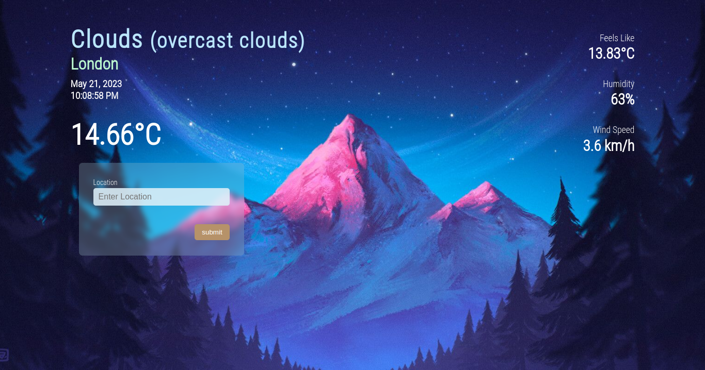

	<h1>Weather App
	 
		
		
		
		
		 
	</h1>
	<h3><b><a href="https://rique2x.github.io/Weather-App/">View Live Demo</a></b></h3>

## Description

This is a weather app created as part of [TheOdinProject](https://www.theodinproject.com) curriculum.

To see the assignment details - [Click Here](https://www.theodinproject.com/lessons/node-path-javascript-weather-app)

## Built Using

-   HTML5 
-   SASS 
-   JavaScript 
-   Webpack 

#### Other tools used

-   ESLint 
-   Prettier 

## Credits

#### API

-   [OpenWeather](https://openweathermap.org/)

#### JavaScript Libraries

-   [date-fns](https://date-fns.org/)

#### Icons

-   [Simple Icons](https://simpleicons.org/)
-   [Google Material Icons](https://fonts.google.com/icons?icon.set=Material+Icons)

#### Assets

-   Background SVG from [haikei](https://app.haikei.app/)
-   CSS Loading Animation by [@G4b413l](https://uiverse.io/profile/G4b413l) from [uiverse.io](https://uiverse.io/)

#### Favicon

-   [favicon.io](https://favicon.io/)

## Gallery

### Desktop

### Mobile View

